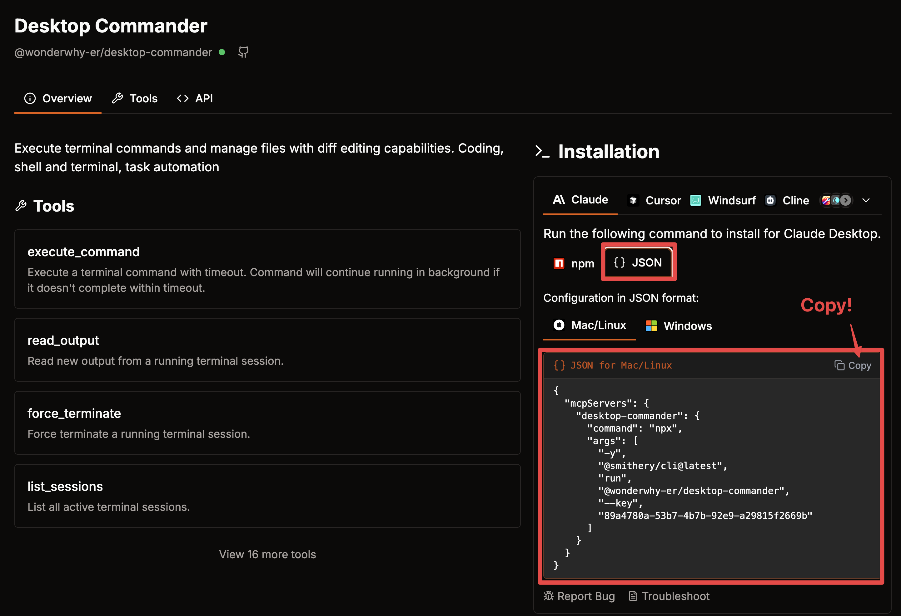

# htm-mcp-agent


[![Open in - LangGraph Studio](https://img.shields.io/badge/Open_in-LangGraph_Studio-00324d.svg?logo=data:image/svg%2bxml;base64,PHN2ZyB4bWxucz0iaHR0cDovL3d3dy53My5vcmcvMjAwMC9zdmciIHdpZHRoPSI4NS4zMzMiIGhlaWdodD0iODUuMzMzIiB2ZXJzaW9uPSIxLjAiIHZpZXdCb3g9IjAgMCA2NCA2NCI+PHBhdGggZD0iTTEzIDcuOGMtNi4zIDMuMS03LjEgNi4zLTYuOCAyNS43LjQgMjQuNi4zIDI0LjUgMjUuOSAyNC41QzU3LjUgNTggNTggNTcuNSA1OCAzMi4zIDU4IDcuMyA1Ni43IDYgMzIgNmMtMTIuOCAwLTE2LjEuMy0xOSAxLjhtMzcuNiAxNi42YzIuOCAyLjggMy40IDQuMiAzLjQgNy42cy0uNiA0LjgtMy40IDcuNkw0Ny4yIDQzSDE2LjhsLTMuNC0zLjRjLTQuOC00LjgtNC44LTEwLjQgMC0xNS4ybDMuNC0zLjRoMzAuNHoiLz48cGF0aCBkPSJNMTguOSAyNS42Yy0xLjEgMS4zLTEgMS43LjQgMi41LjkuNiAxLjcgMS44IDEuNyAyLjcgMCAxIC43IDIuOCAxLjYgNC4xIDEuNCAxLjkgMS40IDIuNS4zIDMuMi0xIC42LS42LjkgMS40LjkgMS41IDAgMi43LS41IDIuNy0xIDAtLjYgMS4xLS44IDIuNi0uNGwyLjYuNy0xLjgtMi45Yy01LjktOS4zLTkuNC0xMi4zLTExLjUtOS44TTM5IDI2YzAgMS4xLS45IDIuNS0yIDMuMi0yLjQgMS41LTIuNiAzLjQtLjUgNC4yLjguMyAyIDEuNyAyLjUgMy4xLjYgMS41IDEuNCAyLjMgMiAyIDEuNS0uOSAxLjItMy41LS40LTMuNS0yLjEgMC0yLjgtMi44LS44LTMuMyAxLjYtLjQgMS42LS41IDAtLjYtMS4xLS4xLTEuNS0uNi0xLjItMS42LjctMS43IDMuMy0yLjEgMy41LS41LjEuNS4yIDEuNi4zIDIuMiAwIC43LjkgMS40IDEuOSAxLjYgMi4xLjQgMi4zLTIuMy4yLTMuMi0uOC0uMy0yLTEuNy0yLjUtMy4xLTEuMS0zLTMtMy4zLTMtLjUiLz48L3N2Zz4=)](https://langgraph-studio.vercel.app/templates/open?githubUrl=https://github.com/langchain-ai/react-agent)

## 프로젝트 개요
`htm-mcp-agent` 은 Model Context Protocol(MCP)을 통해 다양한 외부 도구와 데이터 소스에 접근할 수 있는 ReAct 에이전트를 구현한 프로젝트입니다. 이 프로젝트는 LangGraph 의 ReAct 에이전트를 기반으로 하며, MCP 도구를 쉽게 추가하고 구성할 수 있는 인터페이스를 제공합니다.

## 주요 기능

* **LangGraph ReAct 에이전트**: LangGraph를 기반으로 하는 ReAct 에이전트
* **대화 기록**: 에이전트와의 대화 내용 추적 및 관리
* **시스템 프롬프트 설정**: `prompts/system_prompt.yaml` 파일을 수정하여 시스템 프롬프트를 설정할 수 있습니다.

## 설치 방법

1. `.env` 파일 설정하기

`.env.example` 파일을 `.env`로 복사하고 필요한 API 키를 추가합니다.

```bash
cp .env.example .env
```

`.env` 파일에서 `LLM_PROVIDER` 를 설정합니다.

선택 가능(택 1): `ANTHROPIC`, `OPENAI`, `AZURE_OPENAI`

```
LLM_PROVIDER=OPENAI
```

아래는 필요한 API 키 목록입니다. (선택한 `LLM_PROVIDER` 에 따라 설정합니다)

`Anthropic`, `OpenAI`, `Azure OpenAI` 에서 사용할 API 키를 설정합니다.(반드시 하나의 모델은 설정되어야 합니다.)

- `ANTHROPIC_API_KEY`: Anthropic API 키
- `OPENAI_API_KEY`: OpenAI API 키
- `AZURE_OPENAI_API_KEY`: Azure OpenAI API 키
- `AZURE_OPENAI_ENDPOINT`: Azure OpenAI 엔드포인트


3. MCP 도구 설정

`mcp-config` 폴더에 있는 `mcp_config.json` 파일을 기준으로 모델이 사용할 MCP 도구를 설정합니다.
아래는 샘플로 작성된 예시입니다.

```json
{
  "mcpServers": {
    "perplexity-search": {
      "command": "npx",
      "args": [
        "-y",
        "@smithery/cli@latest",
        "run",
        "@arjunkmrm/perplexity-search",
        "--key",
        "SMITHERY_API_KEY 를 입력하세요"
      ],
      "transport": "stdio"
    },
    "get_current_time": {
      "command": "python",
      "args": [
        "/app/resources/mcp_server_time.py"
      ],
      "transport": "stdio"
    }
  }
}
```

4. Smithery 에 등록된 도구 추가

[Smithery](https://smithery.ai/) 에서 사용할 MCP 도구의 JSON 구성을 가져와 도구 대시보드에서 쉽게 추가할 수 있습니다.

1. [Smithery](https://smithery.io) 웹사이트를 방문하여 사용하고 싶은 도구를 선택합니다.
2. 도구 페이지에서 오른쪽의 'COPY' 버튼을 클릭하여 JSON 구성을 복사합니다.



3. `mcp_config.json` 파일을 열고 복사한 JSON을 추가합니다.

> 복사한 내용을 붙여넣기 합니다.

## 애플리케이션 실행

모든 설정이 완료되었다면, 다음 명령어로 실행할 수 있습니다.

> Mac / Linux

```bash
docker-compose build --no-cache && docker-compose up -d
```

docker shell 실행
``` bash
docker exec -it tbb-mcp-agent-langgraph-api-1 bash
```

서버 재시작시 자동 실행을 위한 crontab > @reboot 설정

> Linux

```bash
SHELL=/bin/bash
PATH=/home/ec2-user/.nvm/versions/node/v22.15.0/bin:/home/ec2-user/.local/bin:/home/ec2-user/bin:/usr/local/bin:/usr/bin:/usr/local/sbin:/usr/sbin
NVM_DIR=/home/ec2-user/.nvm
NVM_BIN=/home/ec2-user/.nvm/versions/node/v22.15.0/bin

@reboot sleep 10s ; (~/tbb-mcp-server/.venv/bin/python ~/tbb-mcp-server/resources/mcp_server_time.py > ~/logs/mcp_server_time.log &) ; (~/tbb-mcp-server/.venv/bin/python ~/tbb-mcp-server/resources/mcp_db_schema/mcp_server_db_schema.py > ~/logs/mcp_server_db_schema.log &)  ; (~/tbb-mcp-server/.venv/bin/python ~/tbb-mcp-server/resources/mcp_rag_help_center/mcp_server.py > ~/logs/mcp_server_help_center.log &) ; cd ~/tbb-mcp-server/resources ; (./mcp_atlassian_server.sh > ~/logs/mcp_server_atlassian.log &) ; cd ~/tbb-mcp-agent ; (docker rm tbb-mcp-agent-langgraph-api-1) ; (docker rm tbb-mcp-agent-langgraph-postgres-1) ; (docker rm tbb-mcp-agent-langgraph-redis-1) ; (docker-compose build --no-cache && docker-compose up -d) ; cd ~/tbb-mcp-agent-chat-ui ; (pnpm start:prod)
```
